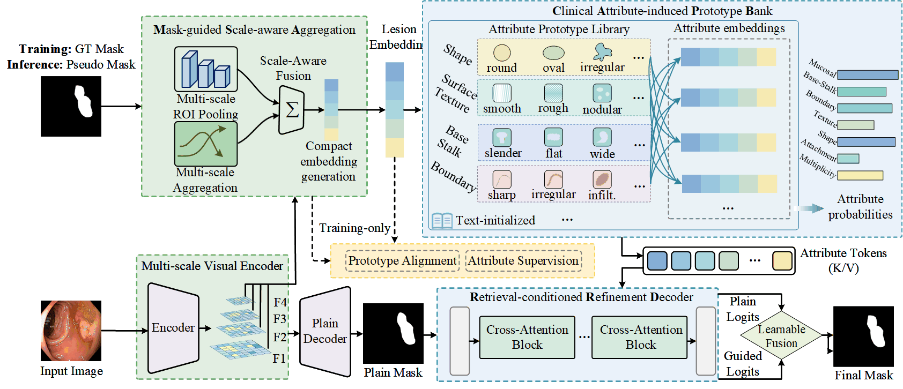

# ReCAP-Seg: Prompt-free Medical Image Segmentation via Retrievable Clinical Attribute Priors

[](#installation)
[](#installation)
[](#installation)
[](#)

Official implementation of **ReCAP-Seg**, a prompt-free medical image segmentation framework that learns from image--mask--attribute triplets during training and performs **image-only inference** at test time.

ReCAP-Seg converts structured clinical attribute annotations into retrievable semantic priors. During inference, the model first predicts a coarse mask, uses it to retrieve slot-wise attribute priors from a learned prototype bank, and then refines the segmentation without requiring any user-provided text prompt, attribute label, bounding box, or point prompt.

> **Paper:** *Prompt-free Medical Image Segmentation via Retrievable Clinical Attribute Priors*
> **Authors:** Yiyang Zhao, Yi Zhou, Jingxiong Li, Yingna Li, Tao Zhou

---

## Overview

Medical image segmentation requires accurate pixel-level delineation. In clinical workflows, lesion description also involves structured morphological and appearance cues, such as shape, boundary, texture, echogenicity, edema, opacity pattern, or lesion-tissue interface. Existing vision-language segmentation methods often rely on explicit textual prompts at inference, which is inconvenient for routine deployment.

ReCAP-Seg addresses this gap by learning a structured, retrievable semantic prior space during training and reusing it automatically during inference.

<p align="center">
  
</p>

The pipeline consists of three core components:

1. **Mask-guided Scale-aware Aggregation (MSA)**
   Aggregates multi-scale encoder features within the lesion region to obtain a lesion-centric embedding. Ground-truth masks are used during training, while coarse pseudo masks are used during inference.

2. **Clinical Attribute-induced Prototype Bank (CAPB)**
   Maintains text-initialized, learnable category-wise prototypes for structured attribute slots. Given a lesion embedding, ReCAP-Seg retrieves soft slot-wise attribute priors via similarity matching.

3. **Retrieval-conditioned Refinement Decoder (RRD)**
   Injects retrieved attribute priors into the decoder via cross-attention and combines the refined prediction with the plain prediction using learnable logit-level fusion.

---

## Attribute Construction and Quality Control

Public segmentation datasets usually provide images and masks but do not include structured clinical attribute labels. We therefore construct training attributes offline.

### Offline annotation workflow

1. **Input:** public, de-identified image--mask pairs.
2. **First-stage annotation:** ChatGPT-4o with vision capability is used as an automatic attribute annotator.
3. **ROI cue:** the segmentation mask is provided as a region-of-interest cue to reduce ambiguity from surrounding tissue or background.
4. **Constrained output:** a fixed prompt template enforces slot-wise, concise, and standardized outputs.
5. **Parsing:** raw outputs are deterministically parsed, normalized, and mapped to predefined discrete categories.
6. **Invalid-slot handling:** uncertain, contradictory, or unparsable slots are marked invalid and excluded from the corresponding attribute-based training objectives rather than being forcibly assigned.
7. **Quality control:** a locally deployed Qwen2.5-VL-32B-Instruct model scores each annotation for consistency, completeness, and schema conformity on a normalized 0--1 scale.
8. **Manual review:** low-scoring samples are manually reviewed and retained only after verification or correction.
9. **Clinician-assisted check:** particularly ambiguous cases are further examined with assistance from two clinical experts.

### Important clarification

ChatGPT-4o is used only during offline preprocessing. It is **not** used during model training, inference, or deployment. After attributes are constructed, ReCAP-Seg is trained and evaluated as an image-only segmentation model at inference time.

## Modality-specific Attribute Schemas

ReCAP-Seg does not use a universal polyp-specific attribute taxonomy across all medical imaging modalities. The overall retrieval framework is shared across tasks, while the concrete semantic slots and category vocabularies are instantiated separately for each target modality.

In this work, we define seven clinically meaningful semantic slots for each modality to maintain implementation consistency. However, only the slot number is kept consistent; the semantic contents are modality-specific. For example, `base_stalk` and `mucosal_activity` are used only for colonoscopy polyp segmentation, whereas `echogenicity` and `posterior_acoustic_feature / halo_sign` are specific to thyroid ultrasound. Non-polyp tasks do not inherit polyp-specific attributes as empty or inactive placeholders.

| Task / Modality | Attribute Schema | Clinical Rationale |
|---|---|---|
| Polyp / Colonoscopy | Multiplicity; Attachment Form; Shape; Surface Texture; Boundary; Base Stalk; Mucosal Activity | Captures endoscopic morphology, lesion-mucosa interface, and local mucosal response that are routinely used in descriptive assessment of polyps. |
| Brain Tumor / MRI | Lesion Distribution; Shape; Margin Definition; Internal Heterogeneity; Peritumoral Interface; Mass Effect / Edema; Intensity Pattern | Reflects lesion morphology, tumor boundary clarity, intralesional heterogeneity, and surrounding tissue response that are clinically meaningful in MRI-based tumor characterization. |
| Thyroid Nodule / Ultrasound | Lesion Localization; Shape / Orientation; Margin; Echogenicity; Internal Composition; Calcification; Posterior Acoustic Feature / Halo Sign | Captures standard ultrasound descriptors for thyroid nodules, including echogenic appearance, composition, shape/orientation, margin, and associated acoustic or halo signs. |
| Lung Infection / CT | Distribution / Laterality; Extent; Shape; Margin; Internal Opacity Pattern; Pleural Relation; Associated Signs | Describes infection burden and appearance in CT, including lesion distribution, opacity pattern, boundary property, and associated radiological signs. |

For each task, the Clinical Attribute-induced Prototype Bank (CAPB) is instantiated using the corresponding task-specific schema. Therefore, prototypes are learned only within the active schema of the current task and are not shared across modalities at the attribute-category level.

---

## Prompt-dependent Baseline Construction

ReCAP-Seg performs image-only inference and does not require user-provided text prompts, attribute labels, bounding boxes, or point prompts at test time. However, several compared vision-language baselines are prompt-dependent and require textual inputs during inference.

To ensure reproducibility and avoid manual prompt tuning, we automatically construct one prompt per sample for each prompt-dependent baseline. Specifically, the structured attribute annotations generated during offline preprocessing are converted into method-specific textual prompts using fixed templates. The same conversion rule is applied to all samples for a given baseline, and no per-image manual editing or prompt optimization is performed.

This setting ensures that prompt-dependent baselines are evaluated under a controlled and reproducible protocol. These prompts are used only for reproducing prompt-dependent baseline comparisons and are not used by ReCAP-Seg during inference.

---

## Data Preparation

### Datasets

ReCAP-Seg is evaluated on four medical segmentation scenarios:

* **Polyp / Colonoscopy:** Kvasir, CVC-ClinicDB, CVC-ColonDB, CVC-300, ETIS-LaribPolypDB
* **Brain Tumor / MRI:** BrainMRI FLAIR dataset
* **Thyroid Nodule / Ultrasound:** TN3K, TG3K
* **Lung Infection / CT:** MosMedData+

Please download each dataset from its official source and follow its license or data-use agreement. This repository does not redistribute datasets unless explicitly permitted.

### Recommended data format

```text
data/
├── polyp/
│   ├── train/
│   │   ├── images/
│   │   ├── masks/
│   │   └── attributes.json
│   └── test/
│       ├── Kvasir/
│       ├── CVC-ClinicDB/
│       ├── CVC-ColonDB/
│       ├── CVC-300/
│       └── ETIS/
├── brainmri/
│   ├── train/images/
│   ├── train/masks/
│   └── train/attributes.json
├── thyroid/
│   ├── TN3K/
│   └── TG3K/
└── mosmed/
    ├── images/
    ├── masks/
    └── attributes.json
```

A typical `attributes.json` file can be organized as:

```json
[
  {
    "filename": "sample_0001.png",
    "labels": {
      "multiplicity": ["single"],
      "attachment_form": ["pedunculated"],
      "shape": ["oval"],
      "surface_texture": ["smooth"],
      "boundary": ["sharp"],
      "base_stalk": ["slender_stalk"],
      "mucosal_activity": ["normal"]
    }
  },
  {
    "filename": "sample_0002.png",
    "labels": {
      "multiplicity": ["single"],
      "attachment_form": ["pedunculated"],
      "shape": ["irregular"],
      "surface_texture": ["granular_nodular", "rough"],
      "boundary": ["irregular_margin"],
      "base_stalk": ["slender_stalk"],
      "mucosal_activity": ["congestion_erythema"]
    }
  }
]
```

---

## Training

Example: train ReCAP-Seg on the polyp setting.

```bash
python train.py \
  --config configs/polyp.yaml \
  --data_root data/processed/polyp \
  --save_dir checkpoints/recapseg_polyp
```

